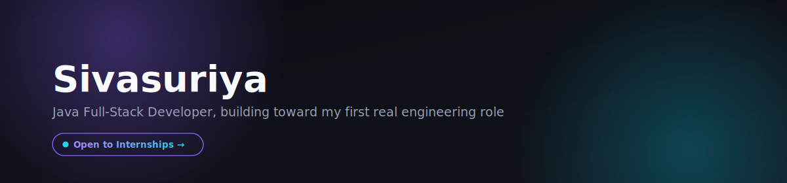
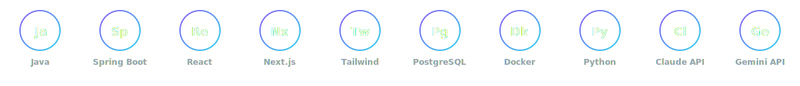

 

&nbsp;&nbsp;
### About me

I'm a final-year CSE student who got tired of tutorial projects that never break, so I started building things with real moving parts — microservices that need to talk to each other, containers that need to network correctly, systems that fail in interesting ways at 1am. That's where I actually learned the most.

I'm looking for an internship or entry-level role where I can keep doing that, alongside people who'll tell me when my code is wrong.

 

 

&nbsp;&nbsp;
### What I've built

**Patient Care Management System** — a microservices backend (auth, patient, billing, analytics + API gateway) in Spring Boot, containerized with Docker.
 The interesting part wasn't the CRUD — it was getting the services to actually find and trust each other. I burned through a few days on Docker networking and container-to-container auth before switching my infra approach entirely to a cleaner Docker Compose setup. I wrote up what I learned so I wouldn't forget it, and so the next person debugging the same thing doesn't have to start from zero.
 `Java` `Spring Boot` `Docker` `PostgreSQL` `Kafka` `gRPC`

**ANTIGRAVITY** — an AI-powered runbook automation agent, built in a hackathon.
 Given a runbook, it classifies commands by risk and can auto-remediate the safe ones, gating anything dangerous for human approval. Built the risk-gating logic specifically so the AI can't just run whatever it wants — that constraint was the actual design problem.
 `Python` `Flask` `React` `MCP`

**Help Desk & Ticket Management System** — role-based, email-integrated support platform.
 My most complete end-to-end build — auth, permissions, and notifications all working together as one real product rather than isolated features.
 `Java` `React` `JWT` `REST APIs`

 

&nbsp;&nbsp;
### Currently

Working through a structured Python roadmap past hackathon-level knowledge, and getting comfortable calling projects "done" only once they have tests, not just a working demo.

  

&nbsp;&nbsp;
### GitHub

  

 

&nbsp;&nbsp;
### Reach me

  

**[Email](mailto:your.email@example.com)**  &nbsp;&#183;&nbsp;  **[LinkedIn](https://linkedin.com/in/yourusername)**  &nbsp;&#183;&nbsp;  **[Portfolio](https://yourportfolio.com)**